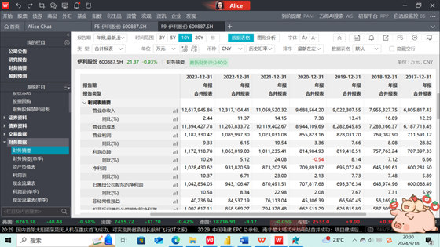
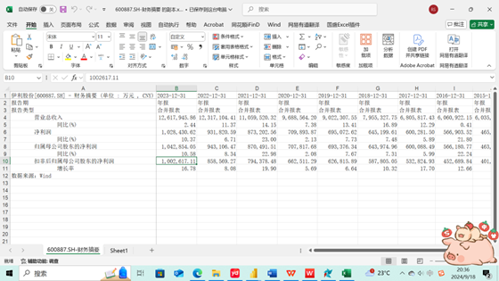
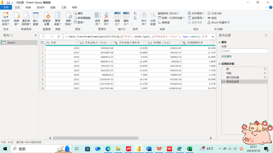
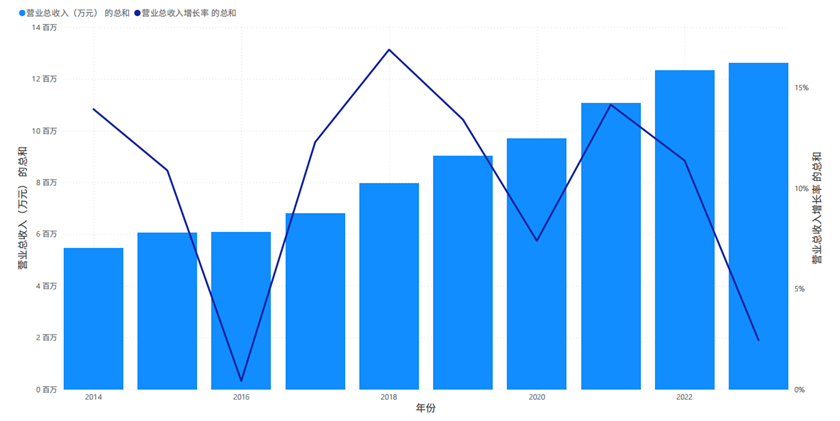
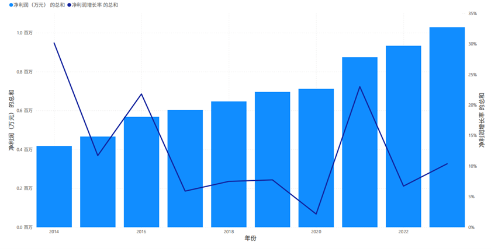
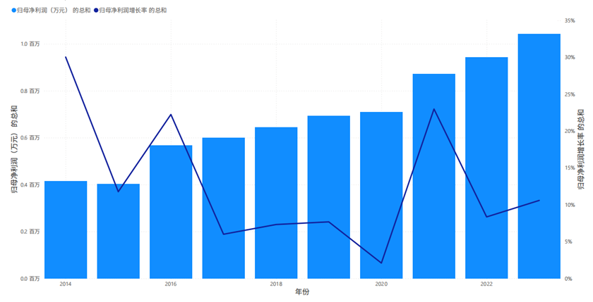
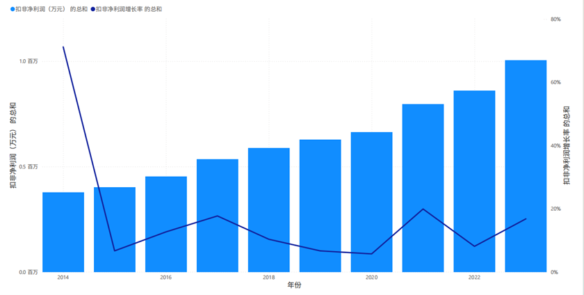

基于Power BI的食品饮料行业上市公司财务分析及可视化分析

1.  确定数据源

首先根据数据分析的目标确定要获取的数据源。本次数据分析的目标是基于 Power BI Desktop 可视化展示中国十大食品饮料上市公司连续10年的财务情况，因此需要获取这些公司的财务指标对应的数据。Wind金融终端提供了上市公司的财务报表数据以及主要财务指标分析数据，包括年报、季报等财务报表，以及基于财务报表的盈利能力分析、偿还能力分析、成长能力分析和营运能力分析等。本项目利用Power BI Desktop 工具，从wind金融终端采集中国十大食品饮料上市公司的财务指标数据。这十大服装上市公司包括蒙牛乳业、伊利股份、农夫山泉、光明乳业、双汇发展、海天味业、三全食品、三元股份、安井食品和康师傅控股，所采集的上市公司财务指标数据包括：归母净利润、营业总收入、净利润、扣非净利润、营业总收入增长率和归母净利润增长率。

1.  获取数据

为了使用 Power BI Desktop 工具自动批量从wind金融终端中获取十大食品饮料上市公司的成长能力指标数据，首先要对数据来源及特点进行分析。

1.  数据来源及特点分析

在Wind首页或相应的导航栏中，找到“食品饮料”行业板块，通常可以在“行业”或“板块”分类下找到，进入“食品饮料”行业板块后，会显示该行业的所有上市公司列表，根据最新的数据和排名，找到中国十大食品饮料上市公司，这些公司包括蒙牛乳业、伊利股份、农夫山泉、光明乳业、双汇发展、海天味业、三全食品、三元股份、安井食品和康师傅控股。在上市公司列表中，点击公司名称，进入该公司的详细页面，可以查看各种财务指标，如营业总收入、净利润、归母净利润和扣非净利润等。如果需要将数据导出进行分析，可以使用Wind的数据导出功能，可以在页面中找到“导出”或“下载”按钮，选择需要的格式（如Excel）进行导出。

1.  根据股票代码收集取数据

（1）伊利股份

在Wind终端的首页找到并点击“股票”模块。在搜索框中输入“伊利股份”的股票代码（600887）或名称，点击搜索按钮。在搜索结果中选择伊利股份，然后点击进入其详细页面，可以找到各种财务数据和指标。查找归属于上市公司股东的净利润，即归母净利润，可以在“利润表”部分找到。查看公司的营业收入总额，也在“利润表”部分。利润率与归母净利润类似，但可能包括少数股东权益的影响，同样在“利润表”部分查找。扣非净利润指扣除非经常性损益后的净利润，这个数据也可以在“利润表”部分找到。查看公司营业收入的增长情况，可以在“财务指标”部分找到。查找归属于上市公司股东的净利润的增长率，同样在“财务指标”部分。将数据导出进行分析，可以使用Wind终端的导出功能，将选中的数据保存为Excel格式的文件。

首先，收集伊利股份近10年的相关财务数据，以从Wind金融终端获取，确保数据包括每年的归母净利润、营业总收入、净利润、扣非净利润、营业总收入增长率和归母净利润增长率。打开Power BI Desktop，点击“获取数据”按钮，选择适合数据格式的数据源（如Excel）。然后，导入准备好的数据文件。在Power BI中，将导入的数据表与相关的维度表（如日期表）关联起来，以构建数据模型，有助于在可视化时按年份筛选和分组数据。为了计算营业总收入增长率和归母净利润增长率，在Power BI中创建相应的度量值，可以使用DAX（数据分析表达式）语言编写计算公式：营业总收入增长率 = ([当前年份的营业总收入] - [上一年份的营业总收入]) / [上一年份的营业总收入]；归母净利润增长率 = ([当前年份的归母净利润] - [上一年份的归母净利润]) / [上一年份的归母净利润]。使用Power BI的可视化功能，创建各种图表来展示伊利股份的财务数据，折线图用于展示归母净利润、营业总收入、净利润和扣非净利润随时间的变化趋势；柱状图用于比较不同年份的营业总收入增长率和归母净利润增长率；组合图结合柱状图和折线图，同时展示财务指标的绝对值和相对增长率。

营业总收入：

净利润：

归母净利润：

扣非净利润：

（2）蒙牛乳业

同理可得蒙牛乳业的各项财务指标。

营业总收入：

净利润：

归母净利润：

扣非净利润：

（3）农夫山泉：

同理可得农夫山泉的各项财务指标，鉴于农夫山泉在港股上市时间较晚，公司公告仅有2017-2023年年报，所以仅展示近7年财务情况。

营业总收入：

净利润：

归母净利润：

扣非净利润：

（4）光明乳业

营业总收入：

净利润：

归母净利润：

扣非净利润：

（5）双汇发展

营业总收入：

净利润：

归母净利润：

扣非净利润：

（6）海天味业

营业总收入：

净利润：

归母净利润：

扣非净利润：

（7）三全食品

营业总收入：

净利润：

归母净利润：

扣非净利润：

（8）三元股份

营业总收入：

净利润：

归母净利润：

扣非净利润：

（9）安井食品

营业总收入：

净利润：

归母净利润：

扣非净利润：

（10）康师傅控股

营业总收入：

净利润：

归母净利润：

扣非净利润：

1.  对数据进行横向比较

使用Power BI进行横向对比十家食品饮料上市公司近10年的营业总收入、净利润、归母净利润和扣非净利润。

（1）生成对比图

在Power BI中创建一个新的项目，并导入收集到的十家食品饮料上市公司的营业总收入数据，使用power query创建新的表格。根据需要分析的财务指标营业总收入，在Power BI中创建相应的度量值，用于后续的数据分析和可视化。使用Power BI的分析工具和功能，对导入的数据进行分析，计算趋势分析和比较分析等。利用Power BI的图表和仪表板功能，将分析结果以直观的方式呈现，创建折线图来展示十家公司近10年之间的营业总收入、净利润、归母净利润和扣非净利润的财务指标对比情况。

营业总收入：

净利润：

归母净利润：

扣非净利润：

（2）通过open AI对图表进行分析

使用Azure OpenAI分析图表内容并输出结果时，先将图表数据转换为文本格式，通过OCR技术将图表中的文字和数值提取出来保存为CSV、TXT或其他支持的格式。在Azure门户中创建Azure OpenAI服务实例，并获取API密钥和终结点。用Azure OpenAI SDK或直接通过REST API调用Azure OpenAI服务，可以使用Python、C\#等编程语言来实现这一点。

Python代码：

将\<your-api-key\>替换为API密钥，将\<your-deployment-id\>替换为模型部署ID。Azure OpenAI会返回一个包含生成内容的响应，可以根据需要进一步处理这个结果，提取关键信息。根据初步结果，调整输入文本和提示词，以获得更准确的分析结果，使用Azure OpenAI Studio进行试验和优化。将这个过程集成，以便自动化地分析图表内容并输出结果。

（3）产出分析结果

三元股份在2014年至2023年间，其营业收入始终保持在6百万元左右，显示出稳定的市场表现；归母净利润在2014年至2022年间保持稳定，保持在5百万元左右。蒙牛乳业营业收入在这段时间内波动较大，但整体呈上升趋势，尤其在2023年达到最高点8百万元；归母净利润在这段时间内波动较大，但在2022年达到最高点7百万元。康师傅控股营业收入在2014年至2023年间相对稳定，保持在3百万元左右；归母净利润在2014年至2023年间保持稳定，保持在3百万元左右。伊利股份营业收入在2014年至2023年间波动较大，但在2022年达到最高点7百万元；归母净利润在2014年至2023年间波动较大，但在2022年达到最高点7百万元。农夫山泉营业收入在这段时间内波动较大，但在2023年达到最高点8百万元；归母净利润在这段时间内波动较大，但在2023年达到最高点7百万元。光明乳业营业收入在这段时间内波动较大，但在2023年达到最高点7百万元；归母净利润在这段时间内波动较大，但在2023年达到最高点7百万元。双汇发展营业收入在2014年至2023年间波动较大，但在2023年达到最高点8百万元；归母净利润在2014年至2023年间波动较大，但在2023年达到最高点7百万元。海天味业营业收入在2014年至2023年间波动较大，但在2023年达到最高点5百万元；归母净利润在这段时间内波动较大，但在2023年达到最高点5百万元。三全食品营业收入在这段时间内波动较大，但在2023年达到最高点5百万元；归母净利润在2014年至2023年间波动较大，但在2023年达到最高点5百万元。安井食品营业收入在2014年至2023年间波动较大，但在2023年达到最高点5百万元；归母净利润在这段时间内波动较大，但在2023年达到最高点5百万元。

三元股份、伊利股份、光明乳业和双汇发展在2014到2023年的净利润和营业收入持续增长，显示出较强的盈利能力和稳健的成长性。这些公司的净利润和营业收入均在100万元以上，且呈现出稳定的增长趋势，表明它们在市场上具有较强的竞争力和较高的市场份额。

蒙牛乳业、康师傅控股、农夫山泉、安井食品则表现出一定的波动性，其净利润和营业收入在如2016年和2020年等时期内有所下滑，但整体上仍保持了一定的增长态势。这些公司可能面临市场竞争激烈、成本压力增大等挑战，需要加强管理和创新以提升竞争力。

海天味业、三全食品、安井食品在2014到2023年之间也取得了一定的业绩增长，但相比其他几家头部企业，其增长速度相对较慢。
